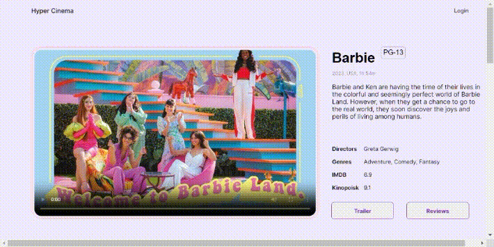

# Project: HyperCinema (Frontend) - Hyperskills

# Hypergram: Image Manipulation Tool
..

## Features
* ..

## Installation
..

## Contributing
Contributions to improve the functionality or user interface of Hypergram are welcome. Please feel free to submit pull requests or open issues on GitHub.
 
[//]: # (&#41;)

#### Notes:
* _This project is tagged as Hard in hyperskills._
* Got to use: 
  * ...
  * Plus alot more
* 
###### Assignment Links
[HyperCinema)](https://hyperskill.org/projects/291?track=5)
